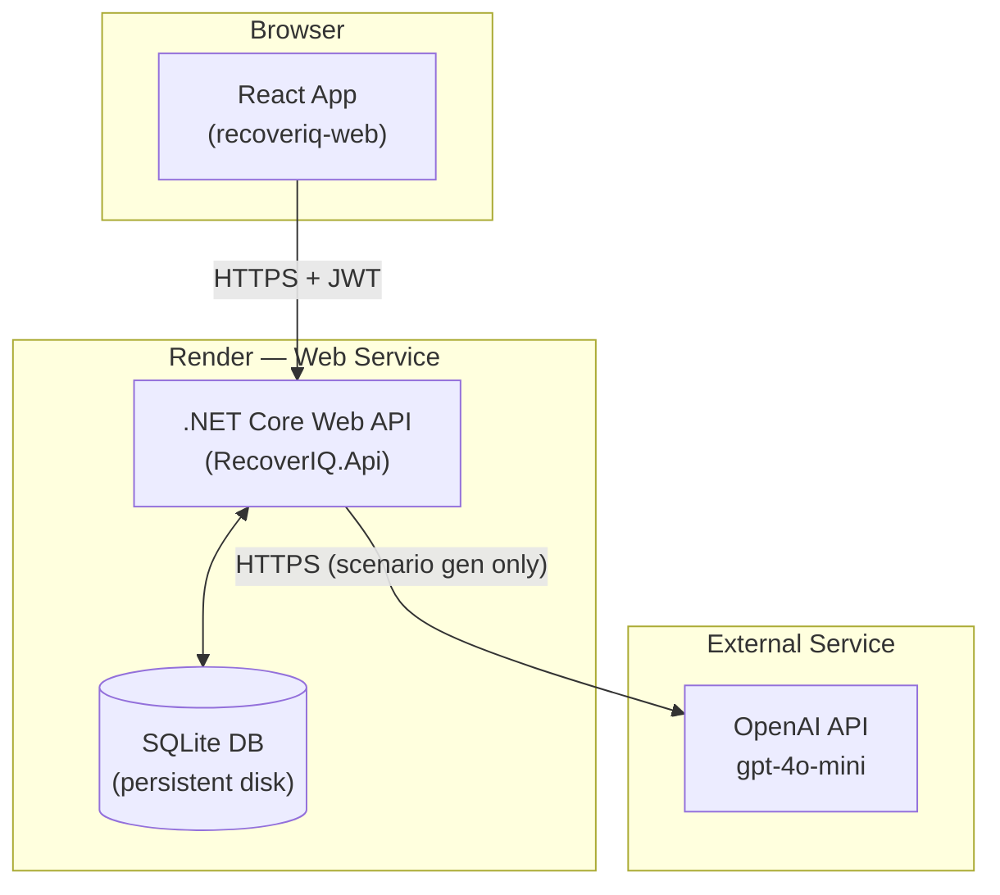
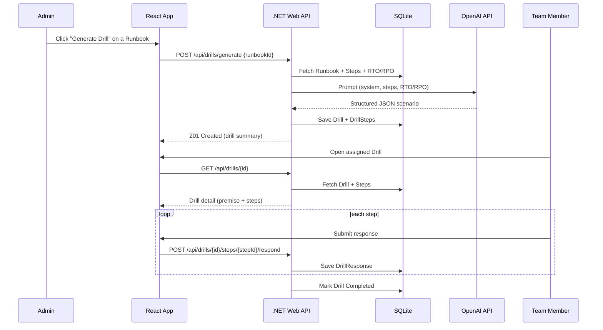
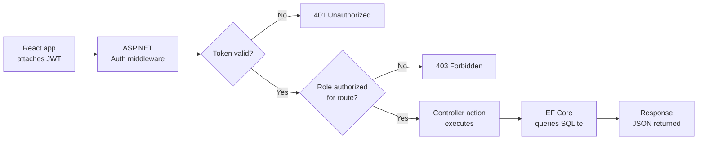

# RecoverIQ — System Architecture

Status: Approved Day 2 | Source of truth for implementation (Days 3–10)

## 1. Tech Stack (Final)

| Layer | Choice |
|---|---|
| Frontend | React (Create React App) |
| Backend | .NET Core Web API (.NET 8) |
| Database | SQLite + Entity Framework Core |
| Auth | JWT + BCrypt password hashing, 2 seeded roles |
| AI | OpenAI API (`gpt-4o-mini`), single upfront call per drill |
| Backend Hosting | Render (free tier, Web Service, persistent disk) |
| Frontend Hosting | Netlify (free tier) |
| Dev Tools | Git/GitHub, Swagger/OpenAPI, DB Browser for SQLite |

## 2. Component Diagram

**Notes**
- The React app never talks to OpenAI directly — all AI calls are proxied through the backend so the API key is never exposed to the browser.
- SQLite lives on Render's persistent disk so data survives restarts/redeploys.

## 3. Data Flow — Core Use Case (Generate & Run a Drill)

## 4. Request Lifecycle (Any Authenticated API Call)

## 5. AI Interaction Detail

- **Trigger:** Admin action only (`POST /api/drills/generate`). Never triggered automatically or by Team Members.
- **Frequency:** Exactly one OpenAI call per drill creation — no retries loop, no live calls during drill execution.
- **Service boundary:** `IScenarioGeneratorService` (backend) is the only component that talks to OpenAI. Swappable/mockable for testing without burning API credits.
- **Failure handling:** If OpenAI returns malformed JSON or errors, the API returns a clean 502-style error to the frontend with a "try again" message — no partial/corrupt drill is saved.
- **Cost control:** Prompt explicitly caps scenario length (4–6 steps); `gpt-4o-mini` used for low cost per generation.

## 6. External Services

| Service | Purpose | Failure Mode Handling |
|---|---|---|
| OpenAI API | Generates tabletop scenario JSON from runbook context | Try/catch in `ScenarioGeneratorService`; user sees a retry prompt, no crash |
| Render | Hosts backend API + SQLite file | Free tier may cold-start after inactivity — acceptable for demo |
| Netlify | Hosts built React frontend | Auto-deploys from GitHub `main` branch |

## 7. Security Notes (v1.0 scope)

- Passwords stored as BCrypt hashes, never plaintext.
- JWT signing key stored as an environment variable in production (never committed to Git).
- OpenAI API key stored as an environment variable in production (never committed to Git); local dev uses `appsettings.Development.json`, which is gitignored.
- CORS restricted to the deployed frontend origin + localhost dev origin only.
