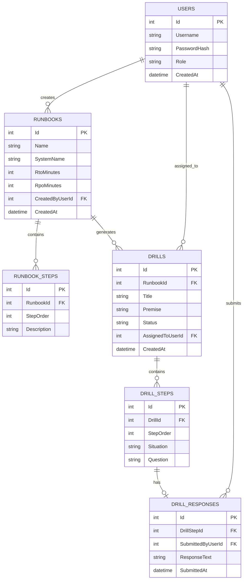

# RecoverIQ — Database Schema

Status: Approved Day 2 | SQLite via EF Core Code-First

## 1. Entity-Relationship Diagram

## 2. Table Definitions

### Users
| Field | Type | Constraints |
|---|---|---|
| Id | int | PK, identity |
| Username | string(50) | required, unique |
| PasswordHash | string | required (BCrypt hash) |
| Role | string(20) | required — `Admin` or `TeamMember` |
| CreatedAt | datetime | required, default now |

**Seed data:** 2 rows — 1 Admin, 1 TeamMember (created via Day 3 seed logic).

### Runbooks
| Field | Type | Constraints |
|---|---|---|
| Id | int | PK, identity |
| Name | string(150) | required |
| SystemName | string(150) | required — e.g. "Payment Gateway" |
| RtoMinutes | int | required, > 0 — Recovery Time Objective |
| RpoMinutes | int | required, > 0 — Recovery Point Objective |
| CreatedByUserId | int | FK → Users.Id, required |
| CreatedAt | datetime | required, default now |

### RunbookSteps
| Field | Type | Constraints |
|---|---|---|
| Id | int | PK, identity |
| RunbookId | int | FK → Runbooks.Id, required, cascade delete |
| StepOrder | int | required, > 0 |
| Description | string(500) | required |

### Drills
| Field | Type | Constraints |
|---|---|---|
| Id | int | PK, identity |
| RunbookId | int | FK → Runbooks.Id, required |
| Title | string(150) | required — from AI response |
| Premise | string(1000) | required — from AI response |
| Status | string(20) | required — `Generated` \| `InProgress` \| `Completed` |
| AssignedToUserId | int | FK → Users.Id, nullable (unassigned until picked up) |
| CreatedAt | datetime | required, default now |

### DrillSteps
| Field | Type | Constraints |
|---|---|---|
| Id | int | PK, identity |
| DrillId | int | FK → Drills.Id, required, cascade delete |
| StepOrder | int | required, > 0 |
| Situation | string(1000) | required — from AI response |
| Question | string(500) | required — from AI response |

### DrillResponses
| Field | Type | Constraints |
|---|---|---|
| Id | int | PK, identity |
| DrillStepId | int | FK → DrillSteps.Id, required, unique (one response per step) |
| SubmittedByUserId | int | FK → Users.Id, required |
| ResponseText | string(2000) | required |
| SubmittedAt | datetime | required, default now |

## 3. Relationships Summary

- One **User** (Admin) creates many **Runbooks** (1:N)
- One **Runbook** has many **RunbookSteps** (1:N, cascade delete)
- One **Runbook** can generate many **Drills** over time (1:N)
- One **Drill** has many **DrillSteps** (1:N, cascade delete)
- One **DrillStep** has at most one **DrillResponse** (1:0..1)
- One **User** (Team Member) is assigned to many **Drills**, and submits many **DrillResponses** (1:N each)

## 4. Constraints & Validation Rules

- `Users.Username` must be unique (enforced via unique index).
- `Users.Role` restricted to `Admin` or `TeamMember` at the application layer (enum in C#, stored as string for readability in DB Browser).
- `Runbooks.RtoMinutes` and `RpoMinutes` must be positive integers (validated in DTO, not just DB).
- `RunbookSteps.StepOrder` must be unique within a given `RunbookId` (validated at save time).
- `DrillSteps.StepOrder` must be unique within a given `DrillId`.
- `DrillResponses` — one response per `DrillStepId` enforced via unique index; resubmission overwrites (update, not insert) rather than allowing duplicates.
- Deleting a `Runbook` cascades to delete its `RunbookSteps` — but does **not** cascade to already-generated `Drills` (drills are historical records and must survive runbook edits/deletion for audit purposes — `RunbookId` on `Drills` becomes nullable-safe / orphan-tolerant).

## 5. Schema Validated Against PRD User Stories

| PRD Requirement (Section 6) | Supported By |
|---|---|
| Admin creates runbook with steps + RTO/RPO | Runbooks + RunbookSteps |
| Admin generates AI scenario from a runbook | Drills + DrillSteps (populated from AI response) |
| Team Member runs a drill, submits responses per step | DrillResponses linked to DrillSteps |
| Admin reviews a completed drill's full record | Drills + DrillSteps + DrillResponses join |
| Two-role auth (Admin / Team Member) | Users.Role |
| Drill history (who, when, which runbook) | Drills.CreatedAt, AssignedToUserId, RunbookId |

All v1.0 user stories are covered. No orphan tables, no unused fields.
