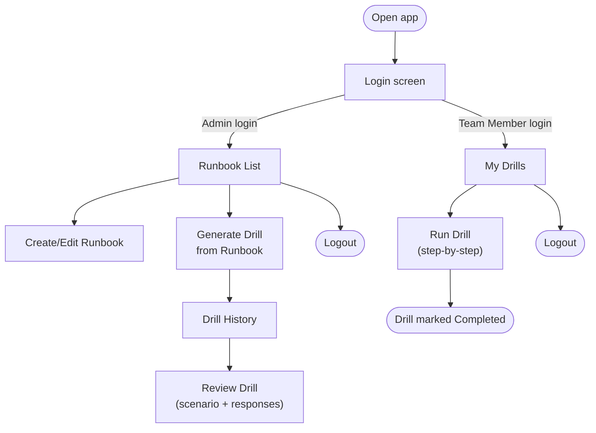
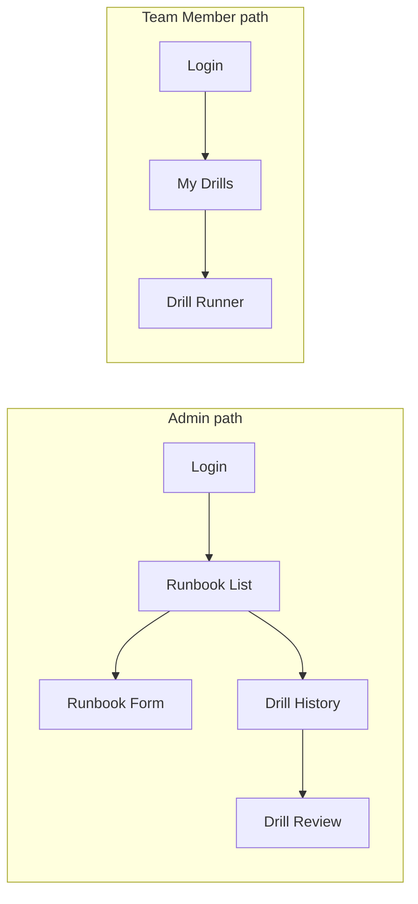

# RecoverIQ — UI & User Flow

Status: Approved Day 2 | Low-fidelity wireframes — visual styling happens during implementation

## 1. User Flow Diagram



## 2. Screen Inventory (Every Screen and Why It Exists)

| # | Screen | Role | Purpose |
|---|---|---|---|
| 1 | Login | Both | Entry point; only way in (no self-registration) |
| 2 | Runbook List | Admin | See all runbooks, jump to create/edit/generate |
| 3 | Runbook Form (Create/Edit) | Admin | Capture recovery steps + RTO/RPO |
| 4 | Drill History | Admin | See all generated drills and their status |
| 5 | Drill Review | Admin | See a completed drill's scenario + responses side by side |
| 6 | My Drills | Team Member | See drills assigned to them |
| 7 | Drill Runner | Team Member | Step-by-step guided scenario with response input |

No screen exists without a direct PRD requirement — 7 screens total, matching the two-role, single-flow scope.

## 3. Screen Flow (by Role)



## 4. Navigation

- Top nav bar present on every screen after login: **RecoverIQ logo/title** (left), **role-aware links** (center — Admin: "Runbooks" / "Drills"; Team Member: "My Drills"), **Logout button** (right).
- No deep multi-level menus — every screen is reachable in 1–2 clicks from login, matching the small v1.0 scope.

## 5. Low-Fidelity Wireframes

### Screen 1 — Login
```
┌───────────────────────────────────────┐
│               RecoverIQ                │
│                                         │
│   Username: [______________________]   │
│   Password: [______________________]   │
│                                         │
│            [   Log In   ]              │
│                                         │
└───────────────────────────────────────┘
```

### Screen 2 — Runbook List (Admin)
```
┌───────────────────────────────────────────────────┐
│ RecoverIQ    Runbooks | Drills            Logout   │
├───────────────────────────────────────────────────┤
│  [ + New Runbook ]                                 │
│                                                     │
│  Name              System            RTO   RPO     │
│  ────────────────────────────────────────────────  │
│  Payment Recovery   Payment Gateway   60m   15m  [Edit][Generate Drill][Delete] │
│  DB Failover Plan    Primary DB        30m   5m   [Edit][Generate Drill][Delete] │
│                                                     │
└───────────────────────────────────────────────────┘
```

### Screen 3 — Runbook Form (Create/Edit)
```
┌───────────────────────────────────────────────────┐
│ RecoverIQ    Runbooks | Drills            Logout   │
├───────────────────────────────────────────────────┤
│  Name:        [___________________________]       │
│  System Name: [___________________________]       │
│  RTO (min):   [_____]   RPO (min): [_____]         │
│                                                     │
│  Recovery Steps:                                   │
│   1. [_____________________________]  [Remove]     │
│   2. [_____________________________]  [Remove]     │
│   [ + Add Step ]                                   │
│                                                     │
│            [ Cancel ]      [ Save Runbook ]         │
└───────────────────────────────────────────────────┘
```

### Screen 4 — Drill History (Admin)
```
┌───────────────────────────────────────────────────┐
│ RecoverIQ    Runbooks | Drills            Logout   │
├───────────────────────────────────────────────────┤
│  Title                Runbook          Status   Date        │
│  ────────────────────────────────────────────────────────── │
│  Ransomware Lockout    Payment Recovery Completed  Sep 14  [Review] │
│  DB Corruption Event   DB Failover      Generated  Sep 13  [Review] │
│                                                     │
└───────────────────────────────────────────────────┘
```

### Screen 5 — Drill Review (Admin)
```
┌───────────────────────────────────────────────────┐
│ RecoverIQ    Runbooks | Drills            Logout   │
├───────────────────────────────────────────────────┤
│  Ransomware Lockout — Completed                    │
│  Premise: A ransomware attack has encrypted...      │
│                                                     │
│  Step 1: Situation text...                         │
│          Question: What do you do first?           │
│          Response: "I would isolate the server..."  │
│  ─────────────────────────────────────────────     │
│  Step 2: Situation text...                         │
│          Question: ...                             │
│          Response: "..."                            │
│                                                     │
└───────────────────────────────────────────────────┘
```

### Screen 6 — My Drills (Team Member)
```
┌───────────────────────────────────────────────────┐
│ RecoverIQ    My Drills                    Logout   │
├───────────────────────────────────────────────────┤
│  Title                Status       Runbook         │
│  ─────────────────────────────────────────────     │
│  Ransomware Lockout    In Progress  Payment Recovery [Continue] │
│  DB Corruption Event   Not Started  DB Failover      [Start]    │
│                                                     │
└───────────────────────────────────────────────────┘
```

### Screen 7 — Drill Runner (Team Member)
```
┌───────────────────────────────────────────────────┐
│ RecoverIQ    My Drills                    Logout   │
├───────────────────────────────────────────────────┤
│  Ransomware Lockout                Step 2 of 5      │
│  ● ● ○ ○ ○                                          │
│                                                     │
│  Situation: The database server has become          │
│  unresponsive and logs show...                      │
│                                                     │
│  Question: What is your next action?                │
│                                                     │
│  [_________________________________________]        │
│  [_________________________________________]        │
│                                                     │
│                          [ Submit & Continue ]       │
└───────────────────────────────────────────────────┘
```

## 6. Design Notes for Implementation

- Keep styling functional and clean — no heavy custom CSS work planned given the time budget (per PRD Non-Functional Requirements).
- Progress indicator (`● ● ○ ○ ○`) on Drill Runner gives Team Members a clear sense of where they are — important since scenarios can be 4–6 steps long.
- Drill Review screen deliberately mirrors Drill Runner's step structure so Admins can quickly map responses back to questions.
